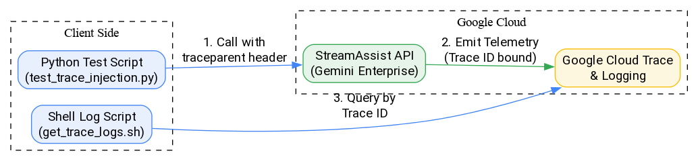

# OpenTelemetry Trace ID Injection for Gemini Enterprise StreamAssist

This package demonstrates how to inject custom OpenTelemetry Trace IDs into the Gemini Enterprise `streamAssist` API call to link external traces with internal execution.


## Architecture & Workflow




* [trace_injection.dot](trace_injection.dot) (Source)


## Prerequisites

1.  **Python 3.11+**
2.  **Google Cloud SDK (`gcloud`)** installed and authenticated.
3.  **Dependencies:** `httpx`, `google-auth`, `opentelemetry-api`, `opentelemetry-sdk`, `opentelemetry-exporter-gcp-trace`.

## Objective & Integration

The goal of this setup is to enable **end-to-end distributed tracing**. 

*   **Apigee:** Captures/Generates the initial Trace ID.
*   **FastMCP Server:** Uses OpenTelemetry to capture the trace, add metadata, and propagate it downstream.
*   **StreamAssist API:** Receives the injected Trace ID via headers, linking backend execution to the client/Apigee trace.

This allows you to unify Apigee logs with Gemini Enterprise execution traces in Google Cloud Observability.


## Setup

Ensure you have authenticated with Google Cloud and set up Application Default Credentials (ADC):

```bash
gcloud auth application-default login
```

## Files

*   `test_trace_injection.py`: Python script that generates a unique Trace ID and Span ID, injects them via the `traceparent` header, calls the `streamAssist` API, and exports the span to GCP.

## How to Run

### 1. Run the Test Injection

Execute the Python script to make the API call. It will print the generated IDs and the streaming response.

```bash
# Using uv (recommended)
uv run python3 test_trace_injection.py

# Or using standard python (ensure dependencies are installed)
python3 test_trace_injection.py
```


## Verification & Expected Output

### 1. Unified Trace Visualization (GCP Console)

When running with the full OpenTelemetry SDK, the local client span is exported to GCP, creating a contiguous trace tree.

**Expected Trace Tree:**
1.  `client-stream-assist-call` (Client-side/FastMCP hop)
2.  `/AssistantService.StreamAssist` (API Entry)
3.  `invoke_agent core_assistant` (Orchestration)
4.  Downstream tool calls (e.g., `google_drive_agent`, `email_agent`)

This eliminates the **"(Missing span ID)"** placeholder that appears when only header injection is used without client-side exporting.


---

## FastMCP & Apigee Integration

For a production setup integrating Apigee, FastMCP, and Gemini Enterprise:

1.  **Apigee** initiates the request and injects the W3C `traceparent` header.
2.  **FastMCP Server** extracts this header, initializes its `tracer`, and starts a span.
3.  The Python client propagates this context to `streamAssist` via headers.
4.  All components export to the same GCP Project Trace ID.

This provides a single dashboard to track latency and errors from the API Gateway down to the GenAI backend.


## Configuration

You can edit the `PROJECT_ID`, `ENGINE_ID`, and `LOCATION` variables in `test_trace_injection.py` to target different environments.

